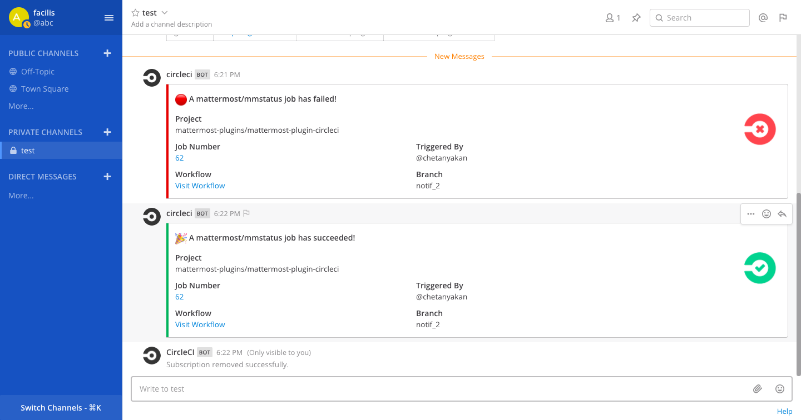

 <h1>Mattermost CircleCI Plugin</h1>

A CircleCI plugin for Mattermost. Supports CircleCI SaaS.

## Table of Contents

 - [Audience](#audience)
 - [License](#license)
 - [About the CircleCI Plugin](#about-the-circleci-plugin)
 - [Before You Start](#before-you-start)
 - [Configuration](#configuration)
 - [Using the Plugin](#using-the-plugin)
 - [Onboarding Your Users](#onboarding-your-users)
 - [Development](#development)

## Audience

This guide is intended for Mattermost System Admins setting up the CircleCI plugin and Mattermost users who want information about the plugin functionality. For more information about contributing to this plugin, visit the [Development section](#development).

## License

This repository is under the [MIT License](https://github.com/chetanyakan/mattermost-plugin-circleci/blob/master/LICENSE).

## About the CircleCI Plugin

The Mattermost CircleCI plugin uses a webhook to connect your CircleCI account to Mattermost to listen for incoming CircleCI events. Event notifications are published in the channels where they are subscribed. 

After your System Admin has [configured the CircleCI plugin](#configuration), run `/circleci connect` in a Mattermost channel to connect your Mattermost and CircleCI accounts.

Once connected, you'll have access to the following features:

* __Event Subscriptions__ - Ability to subscribe to build notifications for specified repositories.
* __Build__ - Ability to trigger build in CircleCI for a project. The build can be triggered for either a branch or a tag.
* __Recent Builds__ - View recent builds for a repository's workflow. For example, view recentr builds for `release` workflow.
* __Pipeline by Number__ - Get details of a pipeline by it's number. Each pipeline execution in CircleCI has a user-readable number which can be used for identifying a pipeline execution.  
* __Environment__ - Get a list of *masked* context variables available to in pipeline.
* __Project Insights__ - Get project insights on demand such as success rate, throughput, mean duration etc.
* __Workflow Insights__ - Get insights of a workflow's runs. This includs details such as execution time, credits used and status.

## Before You Start

This guide assumes:

- You have a CircleCI account.
- You're a Mattermost System Admin.
- You're running Mattermost v5.20 or higher.

## Configuration

1. Go to the plugin system console settings to generate the Webhook Secret and Encryption Key and enable the plugin. Note the value of the `Webhook Secret`.
1. Make sure you are using CircleCI config version v2.1 or above.
1. Use the `status` command from the Mattermost Orb, which is added in the `.circleci/config.yml` of this repo as the last step of any CircleCI Job you created for your workflow to enable notifications to Mattermost.
1. Go to your project settings on CircleCI and add an Environment Variable with the name `WEBHOOK_URL` with the value:
`http://<mattermost_url>/plugins/com.mattermost.circleci/api/v1/webhook?secret=<webhook_secret>`
    - Replace `<mattermost_url>` with your site URL, for example: `community.mattermost.com`
    - Replace `<webhook_secret>` with the secret generated in the first step

### Generating Personal Access Token

1. Go to CircleCI.
1. Open your profile settings by clicking on your avatar on the bottom left.
1. Select the option `Personal Access Token`.
1. Click on `Create New Token`.
1. Give it an identifiable name such as `Mattermost CircleCI Plugin`.
1. Click on `Add API Token`.
1. Make sure you copy the token as once you close the dialog, you cannot see the generated token again. 

### Subscribing to Notifications

1. Go to the channel in which you want to subscribe to notifications for your project.
1. Use the `/circleci subscribe` command to subscribe this channel to notifications.
    - Usage: `/circleci subscribe <VCS-Type> <Owner-Name> <Repo-Name>`
    - Example: `/circleci subscribe github chetanyakan mattermost-plugin-circleci`

## Using the Plugin

Once you've generated the personal access token, run the `/circlec connect <your auth token>` slash command from any channel within Mattermost to connect your Mattermost account with CircleCI.

## Onboarding Your Users

When you’ve tested the plugin and confirmed it’s working, notify your team so they can connect their CircleCI account to Mattermost and get started. Copy and paste the text below, edit it to suit your requirements, and send it out.

> Hi team, 

> We've set up the Mattermost CircleCI plugin, so you can get notifications from CircleCI in Mattermost. To get started, run the `/circleci connect` slash command from any channel within Mattermost to connect your Mattermost account with CircleCI. Then, take a look at the [available features](#about-the-circleci-plugin) in the plugin for more details.

## Development

This plugin contains a server portion. Read our documentation about the [Developer Workflow](https://developers.mattermost.com/extend/plugins/developer-workflow/) and [Developer Setup](https://developers.mattermost.com/extend/plugins/developer-setup/) for more information about developing and extending plugins.

## Security Vulnerability Disclosure

Do not post a GitHub ticket for security vulnerability. Please report any security vulnerability to `@harshilsharma63` or `@chetanyakan` on [Community Mattermost](https://community.mattermost.com). 
